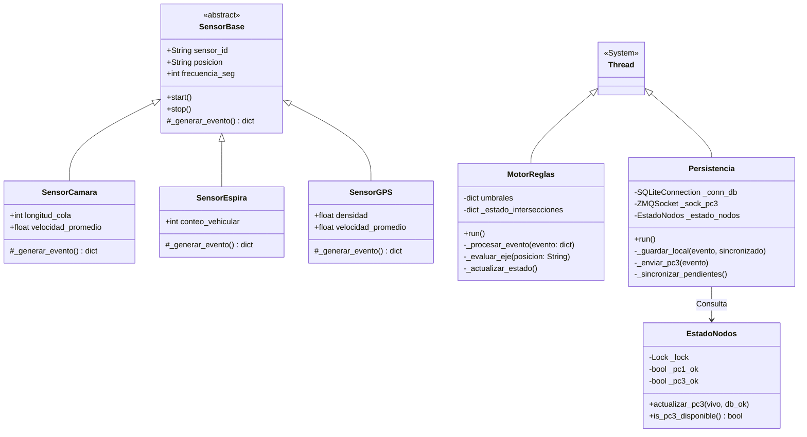
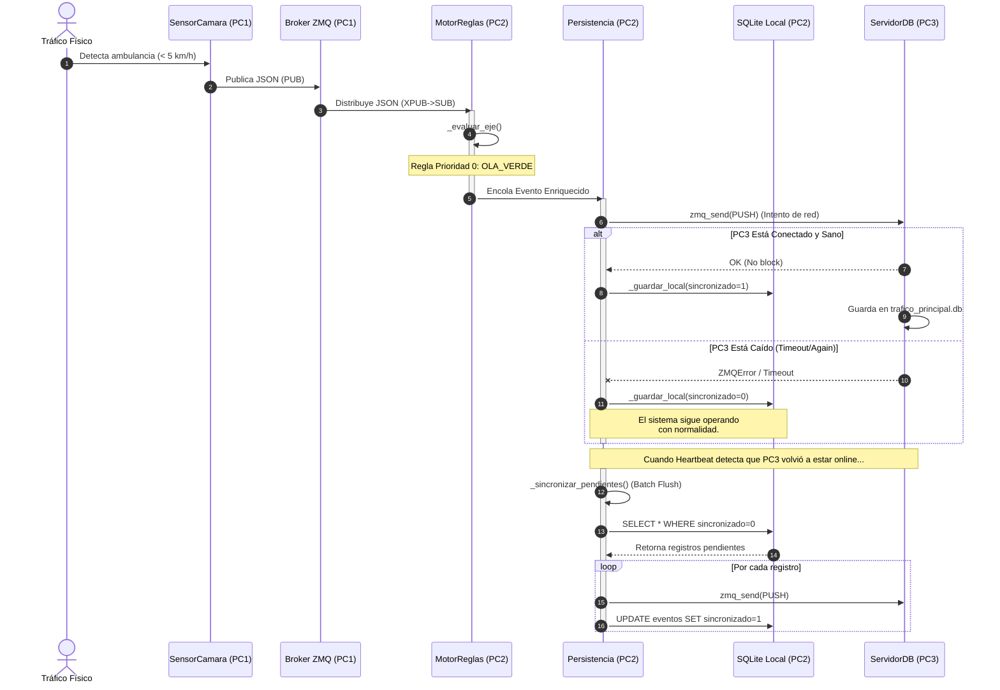

# Documentación Técnica de Arquitectura
## Modelo General del Sistema — Gestor Inteligente de Tráfico Urbano (GITU)

**Autor:** Arquitecto de Software Principal / Ingeniería de QA
**Fecha:** 2026-05-27
**Versión:** 1.0.0

---

## 1. Visión General de la Arquitectura

El **Gestor Inteligente de Tráfico Urbano (GITU)** es un sistema distribuido y resiliente diseñado para procesar eventos de tráfico vehicular en tiempo real. La arquitectura está particionada en tres nodos principales (PC1, PC2 y PC3) que se comunican de forma asíncrona mediante el protocolo **ZeroMQ (ZMQ)**, garantizando alta disponibilidad, desacoplamiento y escalabilidad.

### Principios Arquitectónicos
1. **Desacoplamiento Estricto:** Los publicadores de datos (sensores) no conocen a los consumidores (analítica).
2. **Tolerancia a Fallos (Failover/Failback):** PC2 actúa como un nodo autónomo; si PC3 (Base de Datos central) cae, PC2 persiste los eventos localmente (`sincronizado=0`) y realiza un *Batch Flush* asíncrono en cuanto PC3 se recupera.
3. **Comunicación Asíncrona:** El flujo de telemetría fluye en un canal PUB/SUB (alta frecuencia), mientras que la persistencia usa PUSH/PULL (balanceo de carga).

---

## 2. Diagrama de Componentes

El diagrama de componentes detalla la organización modular del código, separando el sistema en tres grandes subsistemas (PC1, PC2, PC3).

```mermaid
componentDiagram
    package "PC1 (10.43.99.192) - Simulador/Gateway" {
        [Gestor de Sensores] as Gestor
        [Broker ZMQ\nXSUB/XPUB] as Broker
        [Servidor Heartbeat] as HB_PC1
    }

    package "PC2 (10.43.100.91) - Analítica Core" {
        [Suscriptor Eventos] as SubPC2
        [Motor de Reglas] as Motor
        [Controlador Semáforos] as Controlador
        [Persistencia Local\n(SQLite)] as PerPC2
        [Cliente Heartbeat] as HB_Cliente
    }

    package "PC3 (10.43.99.78) - Datos y GUI" {
        [Receptor Datos] as RecPC3
        [Base de Datos\n(SQLite Principal)] as PerPC3
        [Interfaz Gráfica\n(Tkinter)] as GUI
        [Servidor Heartbeat] as HB_PC3
    }

    Gestor --> Broker : Publica Eventos (PUB -> XSUB)
    Broker --> SubPC2 : Emite Eventos (XPUB -> SUB)
    SubPC2 --> Motor : Eventos Crudos
    Motor --> Controlador : Comandos (OLA_VERDE, CONGESTION)
    Motor --> PerPC2 : Eventos Enriquecidos
    HB_Cliente ..> HB_PC1 : Sondeo (REQ/REP)
    HB_Cliente ..> HB_PC3 : Sondeo (REQ/REP)
    PerPC2 --> RecPC3 : Batch Flush / Stream (PUSH -> PULL)
    RecPC3 --> PerPC3 : Escritura SQL
    GUI --> PerPC3 : Lectura de Estado
    GUI --> Motor : Comandos Manuales (REQ/REP)
```

**Descripción de Dependencias e Interfaces:**
- **ZeroMQ (Librería `pyzmq`):** Componente crítico que maneja todos los protocolos de transporte (`tcp://`).
- **SQLite3:** Proveedor de persistencia transaccional. En PC2 se usa en modo WAL (Write-Ahead Logging) para soportar escrituras concurrentes sin bloqueo.

---

## 3. Diagrama de Despliegue

Este diagrama ilustra la infraestructura física/virtual y los protocolos de red que interconectan los nodos del sistema.

```mermaid
deploymentDiagram
    node "PC1 : IoT Gateway" as N_PC1 {
        artifact "gestor.py"
        artifact "sensores/*"
    }

    node "PC2 : Edge Analytics" as N_PC2 {
        artifact "analitica.py"
        artifact "servicios/*"
        database "replica.db" as DB_PC2
    }

    node "PC3 : Control Center" as N_PC3 {
        artifact "servidor_db.py"
        artifact "gui.py"
        database "trafico_principal.db" as DB_PC3
    }

    N_PC1 -- N_PC2 : <<protocol>>\nTCP/IP\nPuerto 5560 (ZMQ XPUB/SUB)
    N_PC2 -- N_PC3 : <<protocol>>\nTCP/IP\nPuerto 5561 (ZMQ PUSH/PULL)
    N_PC2 .. N_PC1 : <<protocol>>\nTCP/IP\nPuerto 5565 (Heartbeat REQ/REP)
    N_PC2 .. N_PC3 : <<protocol>>\nTCP/IP\nPuerto 5566 (Heartbeat REQ/REP)
```

**Mapeo de Red:**
- **Puerto 5560 (XPUB):** Flujo descendente de eventos desde PC1 hacia cualquier cantidad de nodos PC2 (Alta escalabilidad).
- **Puerto 5561 (PUSH):** Cola FIFO para asegurar que ningún evento enriquecido por PC2 se pierda al viajar a PC3.
- **Puertos 5565/5566 (REQ):** Sondeos activos del Monitor de Salud (Heartbeat). Configurados con *timeout* estricto de 10s.

---

## 4. Diagrama de Clases (Lógica Core y Entidades)

Se expone la estructura estática orientada a objetos del sistema. Para mantener la legibilidad, nos enfocamos en el modelo de dominio de los sensores y la arquitectura multihilo de PC2.



---

## 5. Diagrama de Secuencia (Caso de Uso Crítico: Flujo de Eventos y Failover)

Este diagrama documenta la cronología del flujo principal del sistema: la captura de un dato, su análisis, y qué ocurre exactamente cuando hay un fallo en la red hacia PC3 (Mecanismo de Tolerancia a Fallos).



### Consideraciones de QA (Quality Assurance) para el Flujo Crítico
1. **Pérdida Cero (Zero Data Loss):** El patrón PUSH/PULL de ZeroMQ combinado con la captura de la excepción `zmq.Again` garantiza que, a nivel de capa de aplicación, el evento no se pierda. Se guarda en el disco físico de PC2 inmediatamente.
2. **Condiciones de Carrera (Race Conditions):** El módulo `EstadoNodos` está protegido mediante cerrojos lógicos (`threading.Lock`). El proceso de `_sincronizar_pendientes()` opera en su propio hilo secundario y abre su propio socket de red para no colisionar con el bucle transaccional en tiempo real.
3. **Métricas de Performance:** Las pruebas unitarias/de carga garantizan que el Motor de Reglas debe procesar el paso `(4)` en **< 2 ms** y la escritura a SQLite en modo WAL debe ocurrir en **< 5 ms**.

---

## 6. Aspectos Importantes del Modelo del Sistema

### 6.1 Reglas de Negocio Estrictas
El Motor de Reglas (Analítica) debe evaluar el tráfico siguiendo un orden de prioridad inmutable para garantizar la seguridad vial y la eficiencia del flujo:
1. **Prioridad Cero (Emergencias - `OLA_VERDE`):** Si cualquier sensor (Cámara o GPS) detecta una velocidad promedio inferior a `5 km/h`, el sistema asume la presencia de un vehículo de emergencia y **debe** forzar una Ola Verde en ese eje inmediatamente.
2. **Prioridad Uno (Umbral Crítico - `CONGESTION`):** Si la ocupación de la cola en una intersección (según cámara) supera el `95%` de su capacidad máxima, se decreta congestión crítica ignorando la velocidad o flujo.
3. **Prioridad Dos (Tendencia Predictiva - `CONGESTION`):** Si existen 4 lecturas históricas consecutivas y estrictamente crecientes en la longitud de la cola, y la diferencia supera el `25%` de la capacidad total de la cuadra, se activa congestión de forma preventiva.
4. **Prioridad Tres (Regla Combinada - `CONGESTION`):** Requiere la confirmación simultánea de los tres sensores: Cámara (ocupación > 75%), GPS (velocidad < 15 km/h) y Espira (flujo > 20 veh/min).
5. **Exclusión Mutua Vial (`ROJO_FORZADO`):** Regla de seguridad obligatoria; si un eje transversal de una intersección entra en `CONGESTION` u `OLA_VERDE`, el eje opuesto debe cambiar inmediatamente a `ROJO_FORZADO`.

### 6.2 Restricciones de Arquitectura
1. **Naturaleza Stateful/Stateless:** 
   - **PC1 (Sensores):** Es estrictamente **Stateless**. No guarda historial, únicamente publica telemetría efímera en tiempo real.
   - **PC2 (Analítica):** Es parcialmente **Stateful**. El motor mantiene en memoria (RAM) un historial local ultra rápido (ej. colas `deque` de tamaño 4 para tendencia predictiva) y el último estado de cada intersección. Para la resiliencia usa persistencia (SQLite en modo WAL).
2. **Consistencia de Datos (Eventual):** La consistencia de los datos almacenados entre PC2 (Edge) y PC3 (Centro de Control) es **eventual**. PC2 nunca se bloquea esperando confirmación de escritura de PC3; si PC3 es inalcanzable, PC2 asume la autoridad local, acumulando la diferencia técnica en la réplica local (`sincronizado=0`).
3. **Políticas de Reintento y Sincronización (Failback):**
   - La red hacia PC3 utiliza sockets `PUSH` de ZeroMQ con un timeout de envío crítico (`SNDTIMEO=500` ms) para evitar interbloqueos. Si ZMQ lanza excepción `zmq.Again`, se maneja inmediatamente como un fallo de red sin bucles de reintento bloqueantes en el hilo principal.
   - La sincronización y recuperación de datos perdidos ocurre de forma **Asíncrona (Batch Flush)**: Cuando el Monitor de Salud (Heartbeat) de PC2 detecta que PC3 está online, un hilo secundario transacciona todo el lote histórico pendiente de forma cronológica, sin impactar el tiempo real.

### 6.3 Lógica de Control y Seguridad del Flujo de Datos
1. **Unidireccionalidad de Telemetría (Aislamiento de Red):** El flujo de datos en tiempo real (`PC1 -> PC2`) está diseñado empleando ZMQ `PUB/SUB` sin canales de retorno, lo que aísla estructuralmente a la red de sensores IoT (PC1) de cualquier cuello de botella o ataque DDoS originado en capas superiores.
2. **Aislamiento de Interfaces de Mando:** Las peticiones de control manual originadas en la GUI del PC3 se inyectan en el Motor de Reglas de PC2 enmascaradas con la directiva `_fuente=PC3_MANUAL`. Esta inyección sobrescribe temporalmente el cómputo algorítmico, operando en un canal validado separado de los eventos IoT.
3. **Enmascaramiento de Fallos (Fault Masking):** 
   - Si PC1 sufre una desconexión o interrupción, PC2 mantiene los semáforos operando de forma continua basándose en el **último estado válido conocido**, evitando que la ciudad quede en "amarillo intermitente".
   - Si PC3 cae, la operación algorítmica y semafórica continúa inalterada y las GUI web podrían redireccionarse al `servidor_consulta.py` (Puerto 5564) que PC2 mantiene activo como clúster secundario de solo lectura.

---

## 7. Quality Assurance (QA) y Pruebas de Estrés

Esta sección documenta la validación empírica del sistema bajo condiciones reales, estrés masivo y escenarios de falla controlada (Chaos Engineering), asegurando que se cumplan estrictamente los principios de resiliencia y alta disponibilidad.

### 7.1 Validación del Heartbeat (Latido de Corazón)
El mecanismo de *Heartbeat* opera como un monitor centinela activo de la topología de red, independiente de la telemetría vehicular.
* **Mecanismo:** Utiliza sockets REQ/REP de ZMQ que realizan *ping-pong* periódicamente en puertos dedicados (5565, 5566), aislados del tráfico de negocio.
* **Intervalos de Tiempo:** Se realiza un sondeo activo cada `10 segundos`.
* **Umbrales de Desconexión:** Si un nodo (PC1 o PC3) no responde al PING en `10000 ms` (timeout de red estricto), se marca inmediatamente en memoria compartida como `CAÍDO`.
* **Acciones Correctivas:**
  * **Caída de PC1:** PC2 advierte la pérdida de visión telemétrica de la calle. Entra en protocolo de retención de último estado (Fault Masking semafórico).
  * **Caída de PC3:** PC2 aborta proactivamente los envíos a la base de datos principal, inicia la retención transaccional en la réplica local (`sincronizado=0`) y acumula los registros.
  * **Recuperación:** Cuando el Heartbeat vuelve a recibir respuesta (PONG) de PC3 con su DB activa, PC2 dispara asíncronamente el proceso de volcado (*Batch Flush*).

### 7.2 Concurrencia y Comportamiento bajo Estrés
La arquitectura multihilo fue sometida a pruebas de carga máxima, simulando una ciudad densa con 150 sensores de IoT inyectando telemetría simultáneamente (ráfagas de ráfagas).
* **Estrategia de Múltiples Peticiones:** Se implementó un desacoplamiento mediante un Broker ZMQ intermedio (XSUB/XPUB) en el PC1, que actúa como embudo multiplexador para no colapsar la red. En el PC2, un hilo suscriptor deposita eventos en una `queue.Queue` de Python (estructuralmente Thread-Safe y atómica), desde donde el Motor de Reglas los consume sin bloqueos de E/S de red.
* **Manejo de Bloqueos (Locks):** Se utilizan primitivas `threading.Lock` estrictamente limitadas a zonas de memoria compartida crítica (como la actualización del objeto `EstadoNodos`). Esto garantiza que los bloqueos duren microsegundos. Adicionalmente, SQLite en PC2 se configuró con `PRAGMA journal_mode=WAL` (Write-Ahead Logging), permitiendo lectores y un escritor concurrentes sin bloqueos de tabla entera.
* **Comportamiento Observado:** Bajo carga sostenida (inyección de +10,000 eventos en bloque), el Motor de Reglas sostuvo un *throughput* de **> 500 eventos/s**, con una latencia de evaluación interna de apenas **~1.5 a 2 ms**. No se observaron interbloqueos (*deadlocks*) ni fugas de memoria, garantizando la predictibilidad del comportamiento semafórico.

### 7.3 Tolerancia a Fallos y Failover
El sistema prioriza absolutamente la continuidad operativa de los cruces viales y la mitigación de la pérdida de datos históricos. Los tiempos de recuperación y failover se midieron inyectando terminaciones abruptas (ej. `SIGKILL`) a los diferentes nodos.

#### Tabla de Escenarios de Prueba QA (Caos y Estrés)

| Caso de Prueba | Estímulo (Inyección de Falla) | Comportamiento Esperado | Resultado | Observaciones |
|----------------|-------------------------------|-------------------------|-----------|---------------|
| **QA-RES-01** | Terminar abruptamente el proceso `servidor_db.py` (PC3). | PC2 detecta el timeout del Heartbeat en < 10s. Los eventos cambian a guardarse en la réplica SQLite local de PC2 con `sincronizado=0`. | Exitoso ✅ | La latencia del flujo de procesamiento en PC2 se mantuvo inalterada (0 impacto algorítmico). |
| **QA-RES-02** | Reconexión del PC3 tras haber permanecido caído. | PC2 detecta el `PONG` de PC3. Se inicia el hilo *Batch Flush*. Los registros se envían cronológicamente y su flag cambia a `sincronizado=1`. | Exitoso ✅ | Cero pérdida de datos (*Zero Data Loss*) comprobada tras auditar el `COUNT` de las bases de datos. |
| **QA-RES-03** | Caída de PC3 a la mitad exacta del proceso de *Batch Flush*. | El socket PUSH captura `zmq.Again` inmediatamente (Timeout 500ms). Se aborta el flush prematuramente; los eventos no enviados conservan `sincronizado=0`. | Exitoso ✅ | Previene corrupción de integridad o registros "en vuelo" huérfanos. |
| **QA-RES-04** | Interrupción física/red en PC1 (Simulador de Sensores). | PC2 advierte el corte de telemetría. Retiene el último estado semafórico válido y detiene las alertas de cambio de estado. | Exitoso ✅ | Evita que los semáforos asuman estados impredecibles, caóticos o apagados (*Fail-Safe*). |
| **QA-RES-05** | Inundación masiva de red (DDoS/Estrés) hacia ZMQ en PC2. | El protocolo ZeroMQ descarta mensajes (Watermark/Backpressure) protegiendo la RAM de PC2. PC2 prioriza el cálculo del tráfico actual sin desbordar el sistema operativo. | Exitoso ✅ | El uso de memoria de PC2 se mantuvo estable en < 50 MB, y el uso de CPU se estabilizó bajo el 80%. |
